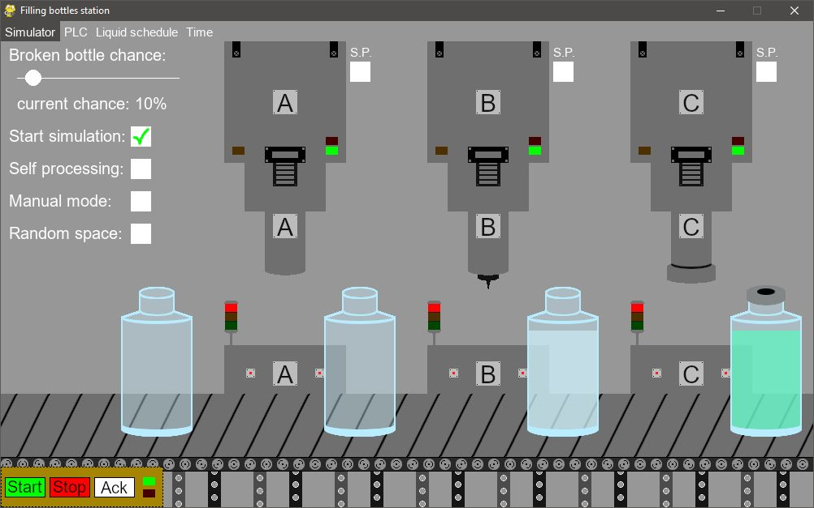

# Simulator of filling bottles station controllable via PLC
This project is part of the completed diploma thesis.

Programing language: Python

Additional used software: PyGame, Snap7

## Application description 
Prepared simulation shows a glass bottle filling station using 3 main operations. During the simulation, successive bottles appear on the production line, which transports them between three machines carrying out the following operations: bottle quality control, bottle filling and bottle closing. The prepared simulation enables the occurrence of many emergency situations, resulting, for example, from the appearance of a broken bottle, the correct operation of which belongs to the PLC program controlling the course of the simulated object. The prepared controller application has the ability to connect via Ethernet, both with the real PLC controller and the simulator of such a controller. In addition, the application gives the opportunity to perform simple operations in the simulation, allowing to assess the correctness of the application and enabling gradual implementation in the laboratory.

## Application functionality
- simulation of filling bottles station realized in PyGame;
- controlling simulator behavior via computer keyboard;
- possibility to run simulation in self processing state;
- possibility to connect to PLC device by Snap7 library;
- possibility to connect to PLC simulator by Snap7 library;
- possibility to control simulation from connected PLCs;

## Screenshot of prepared application
